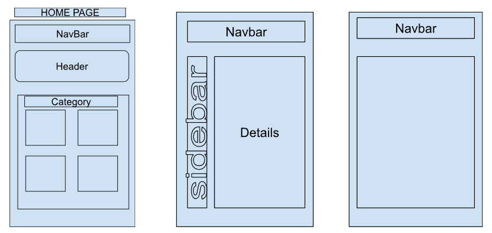

# P2EcommerceStore

This project was generated with [Angular CLI](https://github.com/angular/angular-cli) version 14.2.2.

## Development server

Run `ng serve` for a dev server. Navigate to `http://localhost:4200/`. The application will automatically reload if you change any of the source files.

## Code scaffolding

Run `ng generate component component-name` to generate a new component. You can also use `ng generate directive|pipe|service|class|guard|interface|enum|module`.

## Build

Run `ng build` to build the project. The build artifacts will be stored in the `dist/` directory.

## Running unit tests

Run `ng test` to execute the unit tests via [Karma](https://karma-runner.github.io).

## Running end-to-end tests

Run `ng e2e` to execute the end-to-end tests via a platform of your choice. To use this command, you need to first add a package that implements end-to-end testing capabilities.

## Further help

To get more help on the Angular CLI use `ng help` or go check out the [Angular CLI Overview and Command Reference](https://angular.io/cli) page.

## Project Description

This project is an ecommerce store that allows users to view products, add products to their cart, and checkout. 
The project is built using Angular and TypeScript. The project is also connected to a backend API that is built using Java. 
The backend API locally hosted as well as the front end. The frontend is also connected to a MySQL database that is locally hosted as well.

## Technologies Used
 
* Angular - version 14.2.2
* TypeScript - version 4.4.4
* Java - version 11.0.12
* Spring Boot - version 2.5.4
* MySQL - version 8.0.26
* Spring Data JPA
* Spring Web
* Spring DevTools

## Project Features

* Users can view products
* Users can add products to their cart
* Users can check out
* 
## Getting Started

* Clone the project to your local machine
* Open the project in your IDE
* Configure the project to run on your local machine
* add database connection information to the application.properties file
* Run the project
* Navigate to the localhost url that is displayed in the terminal

## database tables

* item
* user
* order-receipt
* order-item
